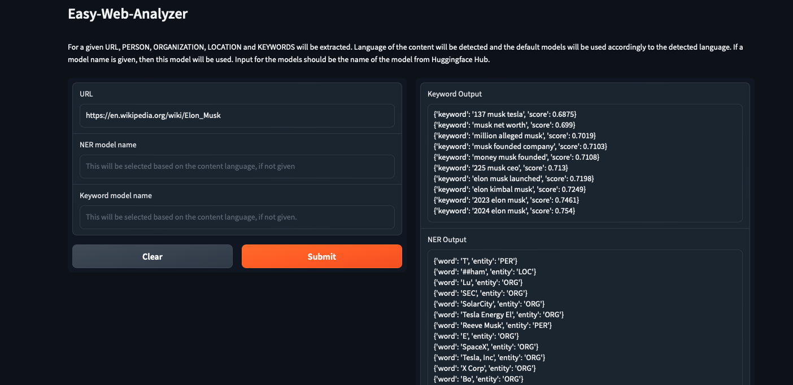

# easy-web-analyzer

## About the Project

This project is developed to extract Named Entity Recognition (NER) results and important keywords from website contents. The project can be used by providing a URL; the system downloads the website content, detects the language it is written in, and then runs NER and KeyBERT models for analysis. It can be used both through the Command Line Interface (CLI) and Gradio User Interface (UI).



## Installation
The project is developed in Python, and you can install it by following these steps:

1. Download or clone the project files to your computer.
2. Install the required Python libraries by running the following command:
```bash
pip install -r requirements.txt
```

## Usage
The project can be used via CLI or Gradio UI. Below are the basic usage guidelines:

### CLI Usage
1. Navigate to the project directory.
2. Run the following command to perform NER and keyword extraction:
```Python
python3 -m EWA.main --url <URL HERE> --save-output true
```

### Gradio UI Usage
1. Navigate to the project directory.
2. Run the following command to start the Gradio UI:
```Python
python3 -m EWA.ui
```


## Default Models

The project uses default NER and keyword extraction models for specific languages. If no model_names are defined the following models are used:

**Turkish (tr):**
* NER: "savasy/bert-base-turkish-ner-cased"
* Keyword: "emrecan/bert-base-turkish-cased-mean-nli-stsb-tr"

**English (en):**
* NER: "dslim/bert-base-NER"
* Keyword: "sentence-transformers/paraphrase-mpnet-base-v2"

**Other Languages (other):**
* NER: "Babelscape/wikineural-multilingual-ner"
* Keyword: "paraphrase-multilingual-MiniLM-L12-v2"

>It uses pretrained models from huggingface.co. NER models are used with a pipeline object.